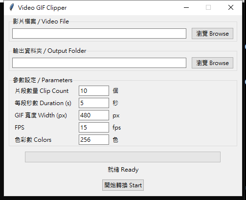

# Video GIF Clipper

> 自動從影片中隨機擷取片段並轉成 GIF  
> Randomly extract clips from a video and convert them to GIF




---

## 功能 Features

- 自動偵測影片長度，隨機選取不重疊的時間點
- 擷取指定數量的片段（預設 10 段），每段指定秒數（預設 5 秒）
- 使用 FFmpeg palette 技術產生高品質 GIF
- 可自訂 GIF 寬度、FPS、色彩數
- 繁體中文 / English 雙語介面

---

## 下載執行檔 Download (Windows)

> 不想安裝 Python？直接下載免安裝版：

**[⬇ 下載 VideoGifClipper-v1.0.0-windows.zip](https://github.com/dinoguo0314/video-gif-clipper/releases/latest)**

1. 下載並解壓縮 ZIP
2. 執行 `VideoGifClipper.exe`
3. 無需安裝 Python 或 FFmpeg，開箱即用

---

## 安裝 Installation

### 1. 安裝 FFmpeg（必要 / Required）

| 平台 | 指令 |
|------|------|
| Windows | 下載 https://ffmpeg.org/download.html，解壓後將 `bin/` 加入 PATH |
| macOS | `brew install ffmpeg` |
| Linux (Debian/Ubuntu) | `sudo apt install ffmpeg` |

安裝完成後在終端機執行 `ffmpeg -version` 確認成功。

### 2. 安裝 Python 3.10+

https://www.python.org/downloads/

### 3. 下載本工具

```bash
git clone https://github.com/dinoguo0314/video-gif-clipper.git
cd video-gif-clipper
```

不需安裝任何額外 Python 套件（僅使用標準函式庫）。

---

## 使用方式 Usage

```bash
python video_gif_clipper.py
```

1. 點擊「瀏覽 Browse」選擇影片檔案
2. 選擇輸出資料夾
3. 調整參數（可保持預設值）
4. 點擊「開始轉換 Start」

輸出 GIF 命名格式：`原檔名_clip01_42s.gif`（數字為起始秒數）

---

## 參數說明 Parameters

| 參數 | 預設值 | 說明 |
|------|--------|------|
| 片段數量 Clip Count | 10 | 要擷取幾段 |
| 每段秒數 Duration | 5 s | 每段 GIF 長度 |
| GIF 寬度 Width | 480 px | 輸出 GIF 寬度（高度自動等比） |
| FPS | 15 | 每秒幀數（越高越順暢，檔案越大） |
| 色彩數 Colors | 256 | GIF 最大色彩數（最高 256） |

---

## 支援格式 Supported Formats

輸入：`.mp4` `.mov` `.avi` `.mkv` `.webm` `.flv` `.wmv`（及 FFmpeg 支援的所有格式）  
輸出：`.gif`

---

## 系統需求 Requirements

- Python 3.10+
- FFmpeg（系統安裝，加入 PATH）
- tkinter（Python 內建，Linux 可能需 `sudo apt install python3-tk`）

---

## 授權 License

MIT License — 詳見 [LICENSE](LICENSE)
